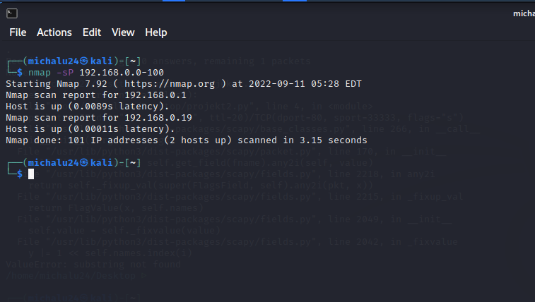

# Our project 

The main goals: 
- [x] Find your IP 
- [x] Find your net mask 
- [x] Based on above: scan your network and find IP addres of the target 
- [x] Find open ports on machine that you're attacking 
- [x] Find name and OS verision of all services that you found 
- [x] Do brute-force attack on any service (it can fail) 

We done our project through few steps:
- ifconfig to find our local network address and ip, netmask
- created script for full automation

And you can see our results thorugh this screenshots: 

First step was to check active hosts in local network

Second step was to create script in python to scan local hosts using scapy:

Third step was to check for open ports on every host:

Fourth step was to perform brute force atack:

Ready result and overhaul script is ip_scanner.py and its effect is as follows:

